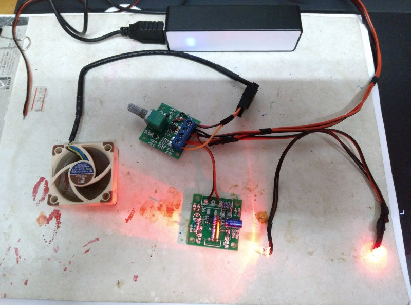
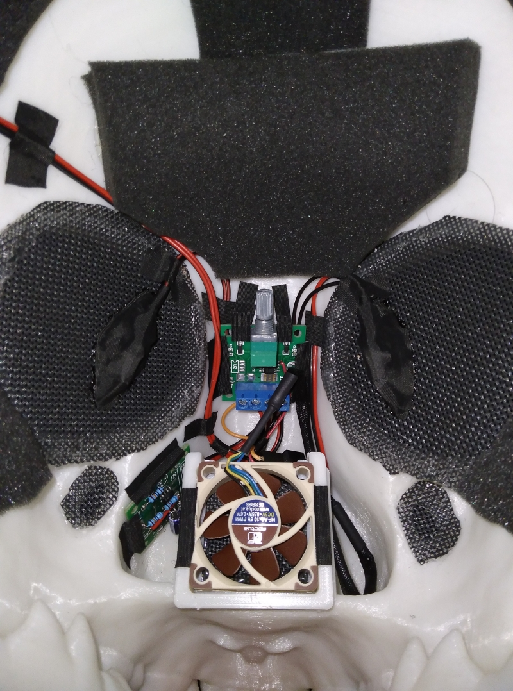
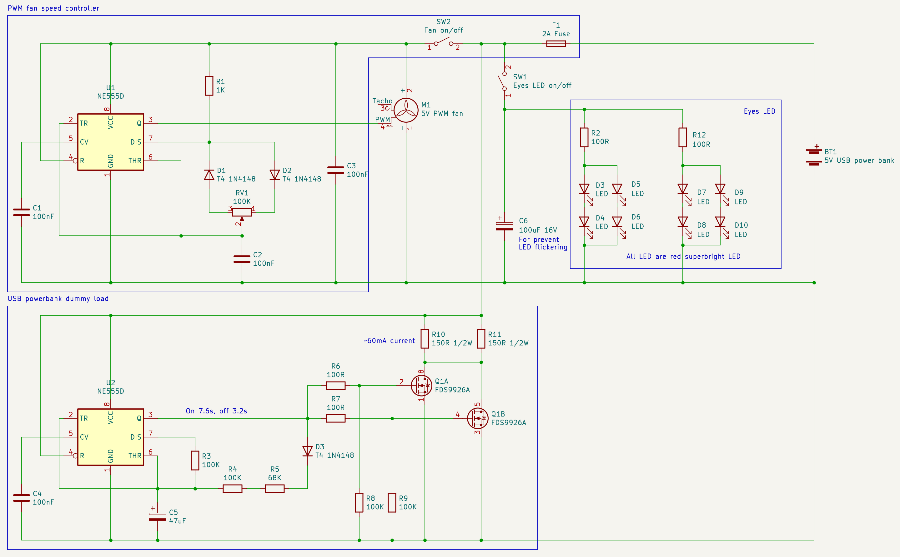
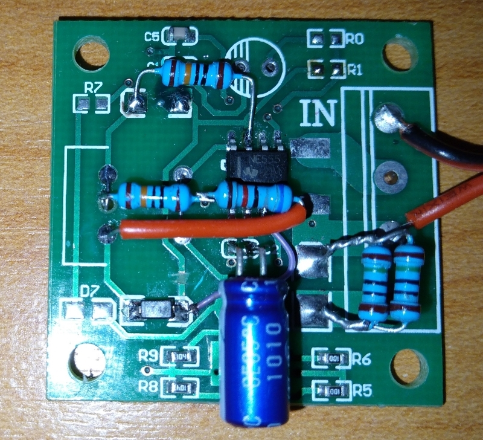

# USB power bank powered fursuit LED eyes and PWM controlled fan

More complicated fursuit light and fan

Assembled

Schematic

USB power bank powered fursuit LED eyes and PWM controlled fan.

Modified from two 1$ "1.8-15V DC motor speed controller board", dummy load schematic idea is from 

PWM controlled fan board

This board generate PWM signal to be use by 4 pin PWM fan (the type used in computer).

I have desoldered the motor driver portion of the "1.8-15V DC motor speed controller board" (U2 (9926 MosFET), R5, R6, R8, R9 and the diode connect to Motor+ and Motor- terminal), along with the status LED and it's resistor (R7 and D7) and connect pin 3 of NE555 to Motor- terminal for connect the PWM signal to pin 4 of the fan.

For the fan, I use Noctua NF-A4x10 5V fan but any 5V 4 pin fan would work.

This board generate 60mA pulsed current load for around 7 second on and 3 second off to satisfies the power bank's current sensing requirement for it not gone into standby mode (always on) by using the motor driver portion of the "1.8-15V DC motor speed controller board" to turn on/turn off the dummy load resistor (R10, R11) based on the pulse generated by NE555. When LED eyes is connected (fan is off) the total power consumption is about 80mA, which was enough for my power bank to operate.

I have desoldered potentiometer, two of the diodes connected to potentiometer, terminal, R7, D7, R1, R1, C1, C2, fuse and the diode connect to Motor+ and Motor- terminal, and resoldered the component from the schematics on to modified PCB.

You may have to change R10 and R11 for the current of dummy load to match your power bank current sensing requirement, and you may have to adjust R3 for off timing and R4/R5 for on timing if it not work with your power bank or to optimize the dummy load to use even less power and more time to cool down.
I also provide [falstad's javascript electronic circuit simulator](http://www.falstad.com/circuit/) file for you to experiment on. 

Also, be mined tho, **the dummy load resistor (R10, R11) will get hot during it work.**

**License**

    Creative Commons - CC0 1.0 Universal (CC0 1.0) Public Domain Dedication
    https://creativecommons.org/publicdomain/zero/1.0/

