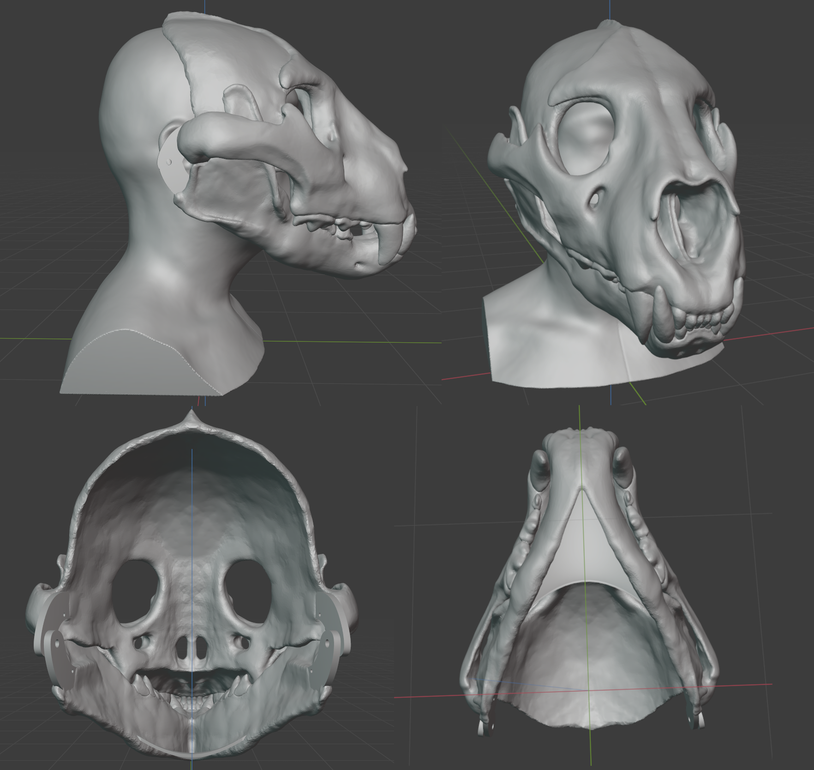

🐾🐾 Openfur 🐾🐾
================

**OwO what's this?**

This repository contain various free and open-source furry related materials that I made.

----------------------

This is my first fursuit head and first 3D printable object that I have design. The design is a semi realistic skull cat mask, suitable for fursuit head, Halloween costume or cosplay. Intended as a base to modify into my fursona's fursuit head in future.

Currently in printable prototype version but with lots of bugs.

Using "Lion - Panthera leo By Lily Wilson" model as base, "3D human head scan by celer" model as head dimension reference and "Jaw Hinge by gootartsis" for the jaw parts. Sculpt using Blender.

**Print Settings**

I use Cura to slice the model and print with Ender-5 Plus. You may have to re-mesh the mesh before slice the model.

- Scale: Scale to fit your head
- Infill Density: 20-30%
- Build Plate Adhesion Type: Raft (because the print keep deattach from the hot-bed in my case)

Printing tips: When using pause print function, you must set the hot-bed at the print temperature (in my case using PLA, 60c) else the print will cool down and will deattached from the hot-bed.

**Bugs**

- Some part of the skull is thinner than other part, it may affect the strength of the print.
- The front is too heavy for my liking.
Need to shaved off some part at the front.
- The chin rest is too long.
- Fangs and the cheek bone/jaw bone overlap, result in the hinge hole doesn't aligned.

**Changelogs**

v0.1

- Initial release.

**Credits**

    Lion - Panthera leo skull by Lily Wilson
    License: Creative Commons - Attribution
    https://sketchfab.com/3d-models/lion-skull-40137a0152074a75a5661ffa24503b3d

    Resin Mask Jaw Hinge by gootartsis
    License: Creative Commons - Public Domain Dedication license.
    https://www.thingiverse.com/thing:2995558

    3D human head scan by celer
    License: Creative Commons - Attribution
    https://www.thingiverse.com/thing:4245056

**License**

    Creative Commons - Attribution-ShareAlike
    https://creativecommons.org/licenses/by-sa/3.0/

Author
------

    Khralkatorrix 🐉🐅
    GitHub: https://github.com/kytulendu
    Twitter: @rra_krr
    Weasyl: https://www.weasyl.com/~khral
    FurAffinity: https://www.furaffinity.net/user/khral
    Discord: Khral#2914
