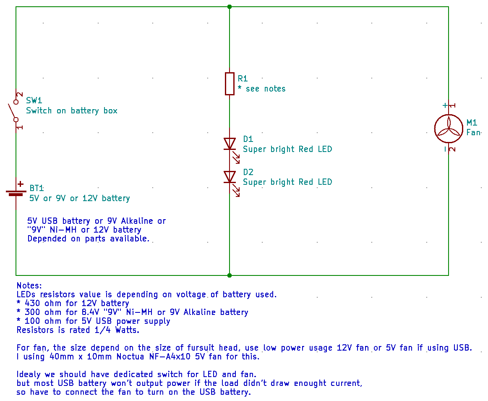
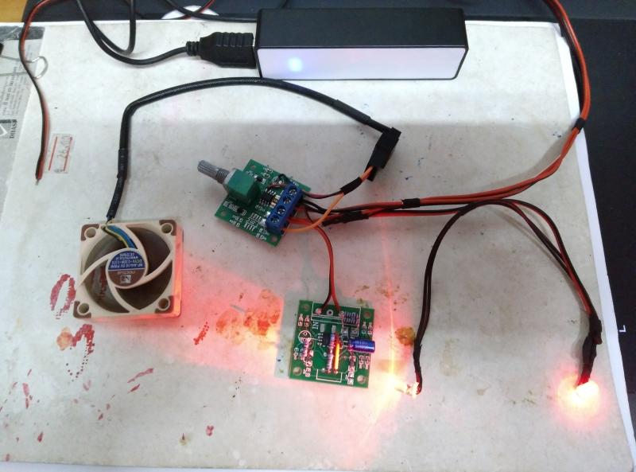
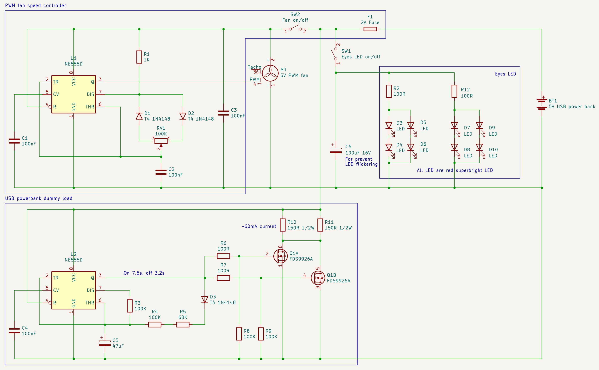
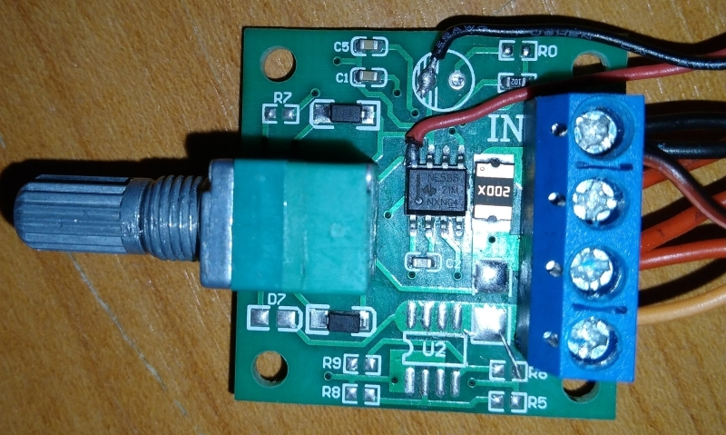

🐾🐾 Openfur 🐾🐾
================

**OwO what's this?**

This repository contain various free and open-source furry related materials that I made.

Contents
--------
- 
- 
- 
- 

----------------------

Skull Cat fursuit head v0.3 model

Finished print

v0.1 Moving jaw test video

This is my first fursuit head and first 3D printable object that I have design. The design is a semi-realistic skull cat mask, suitable for fursuit head, Halloween costume or cosplay. Intended as a base to modify into my fursona's fursuit head in future.

Currently in beta version.

Using "Lion - Panthera leo By Lily Wilson" model as base, "3D human head scan by celer" model as head dimension reference and "Jaw Hinge by gootartsis" for the jaw hinge parts. Sculpt using Blender.

**Print Settings**

I use Cura to slice the model and print with Ender-5 Plus. You may have to re-mesh the mesh before slice the model.

Due to the fursuit head base have been design using my head size in mind, you will have to adjust/modify the model according to your head dimension before print.

- Scale: Scale to fit your head
- Infill Density: 20-30%
- Support: Generate Support
- Build Plate Adhesion Type: Brim or Raft (I use Raft because the print keep deattach from the hot-bed in my case)

Printing tips: When using pause print function, you must set the hot-bed at the print temperature (in my case using PLA, 60c) else the print will cool down and will deattached from the hot-bed.

**Changelogs**

v0.9

- Wide up the mask a bit so it fit more comfortably to wearer.

v0.3

- Fix ugly front teeth of top part.
- Fix chin rest is too thin and too short.
- Fix chin rest mesh that cause problems when slice the model.

v0.2

- Fix eyes at nose too wide.
- Fix cheek bone/jaw bone overlap.
- Fix fangs overlap with each other.
- Fix chin rest is too long.
- Reduce muzzle weight.
- Make some part of the skull a bit thicker.

v0.1

- Initial release.

**Credits**

    Lion - Panthera leo skull by Lily Wilson
    License: Creative Commons - Attribution
    https://sketchfab.com/3d-models/lion-skull-40137a0152074a75a5661ffa24503b3d

    Resin Mask Jaw Hinge by gootartsis
    License: Creative Commons - Public Domain Dedication license.
    https://www.thingiverse.com/thing:2995558

    3D human head scan by celer
    License: Creative Commons - Attribution
    https://www.thingiverse.com/thing:4245056

**License**

    Creative Commons - Attribution-ShareAlike
    https://creativecommons.org/licenses/by-sa/3.0/

----------------------

3D printable fursuit claw for your fursuit handpaw.

I use Cura to slice the model and print with Ender-5 Plus.

Print settings
- Scale: 10000%
- Infill Density: 80%
- Support: No
- Build Plate Adhesion Type: Brim

**License**

    Creative Commons - Attribution-ShareAlike
    https://creativecommons.org/licenses/by-sa/3.0/

----------------------

A simple fursuit LED eyes and fan schematic.

Note: If using fan, prefer using 12V battery pack or USB powerbank instead for longer battery life.

**License**

    Creative Commons - CC0 1.0 Universal (CC0 1.0) Public Domain Dedication
    https://creativecommons.org/publicdomain/zero/1.0/

----------------------

More complicated fursuit light and fan

Assembled

Schematic

USB power bank powered fursuit LED eyes and PWM controlled fan.

Modified from two 1$ "1.8-15V DC motor speed controller board", dummy load schematic idea is from 

PWM controlled fan board

This board generate PWM signal to be use by 4 pin PWM fan (the type used in computer).

I have desoldered the motor driver portion of the "1.8-15V DC motor speed controller board" (U2 (9926 MosFET), R5, R6, R8, R9 and the diode connect to Motor+ and Motor- terminal), along with the status LED and it's resistor (R7 and D7) and connect pin 3 of NE555 to Motor- terminal for connect the PWM signal to pin 4 of the fan.

For the fan, I use Noctua NF-A4x10 5V fan but any 5V 4 pin fan would work.

This board generate 60mA pulsed current load for around 7 second on and 3 second off to satisfies the power bank's current sensing requirement for it not gone into standby mode (always on) by using the motor driver portion of the "1.8-15V DC motor speed controller board" to turn on/turn off the dummy load resistor (R10, R11) based on the pulse generated by NE555. When LED eyes is connected (fan is off) the total power consumption is about 80mA, which was enough for my power bank to operate.

I have desoldered potentiometer, two of the diodes connected to potentiometer, terminal, R7, D7, R1, R1, C1, C2, fuse and the diode connect to Motor+ and Motor- terminal, and resoldered the component from the schematics on to modified PCB.

You may have to change R10 and R11 for the current of dummy load to match your power bank current sensing requirement, and you may have to adjust R3 for off timing and R4/R5 for on timing if it not work with your power bank or to optimize the dummy load to use even less power and more time to cool down.
I also provide  file for you to experiment on. 

Also, be mined tho, **the dummy load resistor (R10, R11) will get hot during it work.**

**License**

    Creative Commons - CC0 1.0 Universal (CC0 1.0) Public Domain Dedication
    https://creativecommons.org/publicdomain/zero/1.0/

Author
------

    Khralkatorrix
    GitHub: https://github.com/kytulendu
    Twitter: @rra_krr
    Weasyl: https://www.weasyl.com/~khral
    FurAffinity: https://www.furaffinity.net/user/khral
    Discord: Khral#2914
