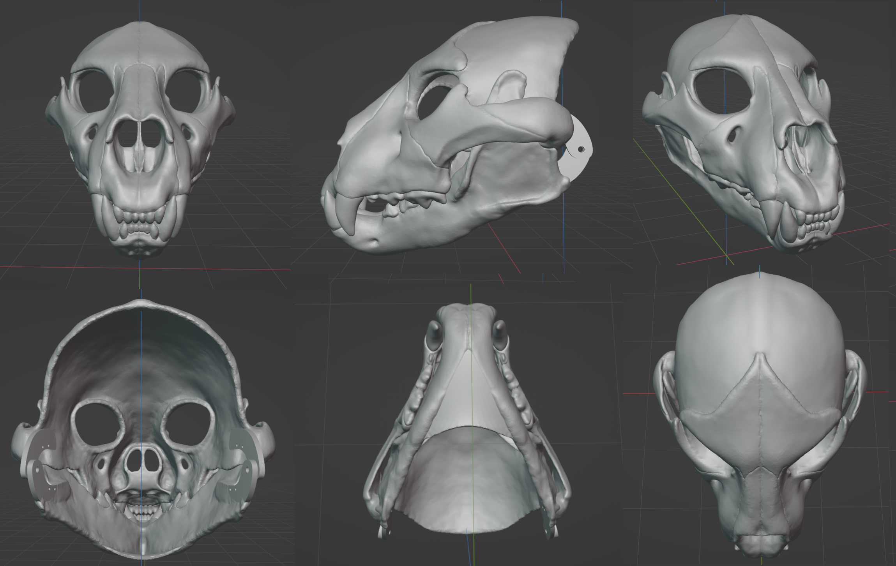
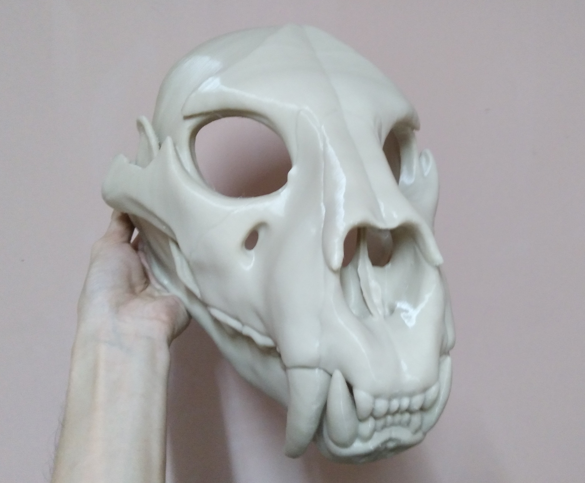
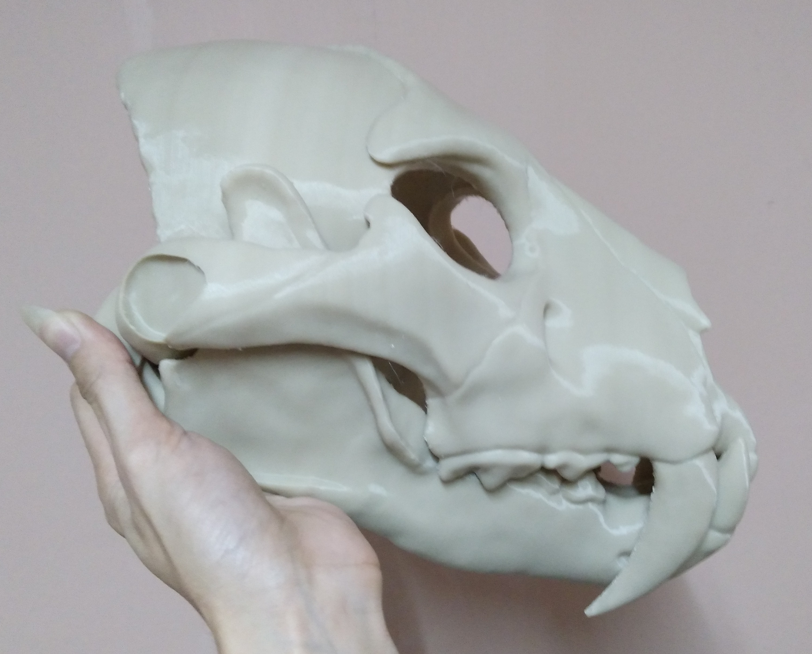
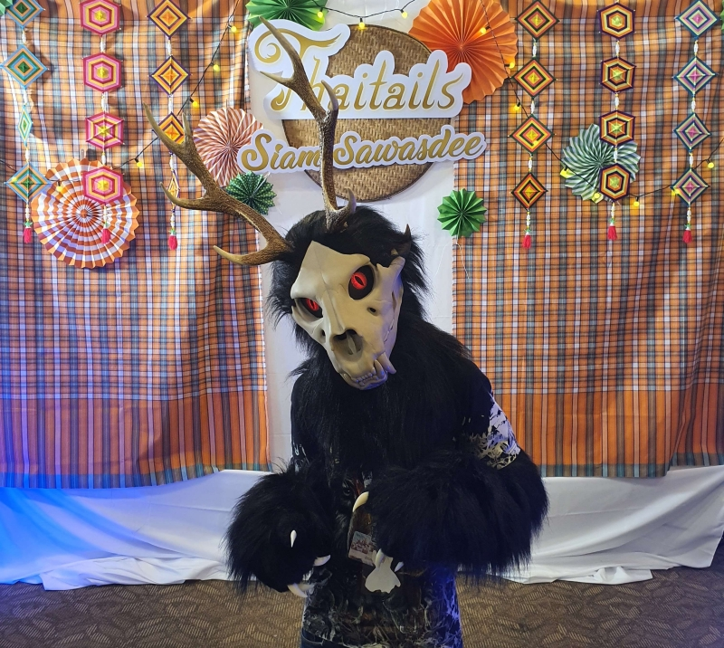

# Skull Cat fursuit head

Skull Cat fursuit head v1.0 model

Finished print example

Fursuit Example

v0.1 Moving jaw test video

This is my first fursuit head and first 3D printable object that I have design. The design is a semi-realistic skull cat mask, suitable for fursuit head, Halloween costume or cosplay. Intended as a base to modify into my fursona's fursuit head.

Using "Lion - Panthera leo By Lily Wilson" 3d scan model as base, "Skull of Smilodon - Saber-Toothed Tiger3D Model by geolab.unilasalle" as saber fangs base, "Printable Mannequin Head with Shoulders by cudatoxis" model as head dimension reference and "Jaw Hinge by gootartsis" for the jaw hinge parts. Sculpt using Blender.

[Download it here](https://github.com/kytulendu/openfur/tree/master/skullcat)

If you like what I make here and/or find it useful for your fursuit project, consider to throw me a coin ^^

**Print Settings**

Default fangs is normal one, if you want saber fangs option, edit boolean modifier of `lion_skull.top` model, from `fang.l` to `saber fang.r`.

I use Cura to slice the model and print with Ender-5 Plus. You may have to re-mesh the mesh before slice the model.

Due to the fursuit head base have been design using my head size in mind, you will have to adjust/modify the model according to your head dimension before print.

- Scale: Scale to fit your head
- Wall Line Count: 4
- Infill Density: 20-30%
- Support: Generate Support
- Support Overhang Angle: ~42.0 or more, use support blocker to exclude some support positions that is not important.
- Build Plate Adhesion Type: Brim or Raft

Printing tips: When using pause print function, you must set the hot-bed at the print temperature (in my case using PLA, 60c) else the print will cool down and will deattached from the hot-bed.

**Todo**

This is todo list intended for Rrowl 2.0 fursuit.

- Add fangs latch for easier assembly alignment.
- Sperate all the teeth.
- Glass eyes support.

**Changelogs**

v1.0
- Make the top fangs a separate model.
- Add both short and saber fangs options.
- Adjustment on eyes shape.
- Weight reduction by remake the nose portion.
- Add second spring holes to jaw hinges.
- Add some skull details.

v0.9.1
- Make chin rest longer.

v0.9

- Wide up the mask a bit so it fit more comfortably to wearer.

v0.3

- Fix ugly front teeth of top part.
- Fix chin rest is too thin and too short.
- Fix chin rest mesh that cause problems when slice the model.

v0.2

- Fix eyes at nose too wide.
- Fix cheek bone/jaw bone overlap.
- Fix fangs overlap with each other.
- Fix chin rest is too long.
- Reduce muzzle weight.
- Make some part of the skull a bit thicker.

v0.1

- Initial release.

**Credits**

    Lion - Panthera leo skull by Lily Wilson
    License: Creative Commons - Attribution
    https://sketchfab.com/3d-models/lion-skull-40137a0152074a75a5661ffa24503b3d

    Skull of Smilodon - Saber-Toothed Tiger3D Model by geolab.unilasalle
    (Use only fangs mesh)
    License: Creative Commons - Attribution
    https://sketchfab.com/3d-models/skull-of-smilodon-saber-toothed-tiger-840cea79937e45438d139a9d4061ab4d

    Resin Mask Jaw Hinge by gootartsis
    License: Creative Commons - Public Domain Dedication license.
    https://www.thingiverse.com/thing:2995558

    3D human head scan by celer (used for head reference in old v0.x version)
    License: Creative Commons - Attribution
    https://www.thingiverse.com/thing:4245056

    Printable Mannequin Head with Shoulders by cudatoxis (used for head reference for v1.0 or newer, not included in repo)
    License: GNU - GPL
    https://www.thingiverse.com/thing:4565947

**License**

    Creative Commons - Attribution-ShareAlike
    https://creativecommons.org/licenses/by-sa/3.0/ 
