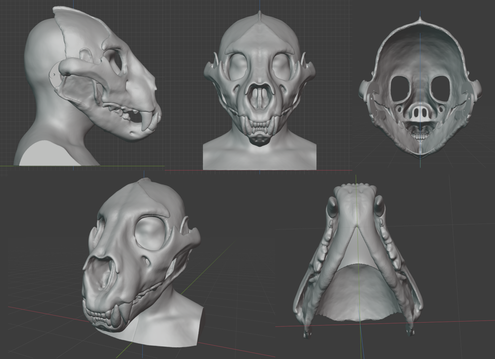

# Skull Cat fursuit head

Skull Cat fursuit head v0.3 model

Finished print

v0.1 Moving jaw test video

This is my first fursuit head and first 3D printable object that I have design. The design is a semi-realistic skull cat mask, suitable for fursuit head, Halloween costume or cosplay. Intended as a base to modify into my fursona's fursuit head.

Currently in beta version.

Using "Lion - Panthera leo By Lily Wilson" model as base, "3D human head scan by celer" model as head dimension reference and "Jaw Hinge by gootartsis" for the jaw hinge parts. Sculpt using Blender.

**Print Settings**

I use Cura to slice the model and print with Ender-5 Plus. You may have to re-mesh the mesh before slice the model.

Due to the fursuit head base have been design using my head size in mind, you will have to adjust/modify the model according to your head dimension before print.

- Scale: Scale to fit your head
- Infill Density: 20-30%
- Support: Generate Support
- Build Plate Adhesion Type: Brim or Raft (I use Raft because the print keep deattach from the hot-bed in my case)

Printing tips: When using pause print function, you must set the hot-bed at the print temperature (in my case using PLA, 60c) else the print will cool down and will deattached from the hot-bed.

**Todo**

This is todo list intended for Rrowl 2.0 fursuit, which the finish version will be release here as v1.0.

- Reduce the head base weight by modify/redesign the nose area and thining some area.
- Sperate fangs from the main model.
- Glass eyes support.
- Skull details.

**Changelogs**

v0.9.1
- Make chin rest longer.

v0.9

- Wide up the mask a bit so it fit more comfortably to wearer.

v0.3

- Fix ugly front teeth of top part.
- Fix chin rest is too thin and too short.
- Fix chin rest mesh that cause problems when slice the model.

v0.2

- Fix eyes at nose too wide.
- Fix cheek bone/jaw bone overlap.
- Fix fangs overlap with each other.
- Fix chin rest is too long.
- Reduce muzzle weight.
- Make some part of the skull a bit thicker.

v0.1

- Initial release.

**Credits**

    Lion - Panthera leo skull by Lily Wilson
    License: Creative Commons - Attribution
    https://sketchfab.com/3d-models/lion-skull-40137a0152074a75a5661ffa24503b3d

    Resin Mask Jaw Hinge by gootartsis
    License: Creative Commons - Public Domain Dedication license.
    https://www.thingiverse.com/thing:2995558

    3D human head scan by celer
    License: Creative Commons - Attribution
    https://www.thingiverse.com/thing:4245056

**License**

    Creative Commons - Attribution-ShareAlike
    https://creativecommons.org/licenses/by-sa/3.0/ 
